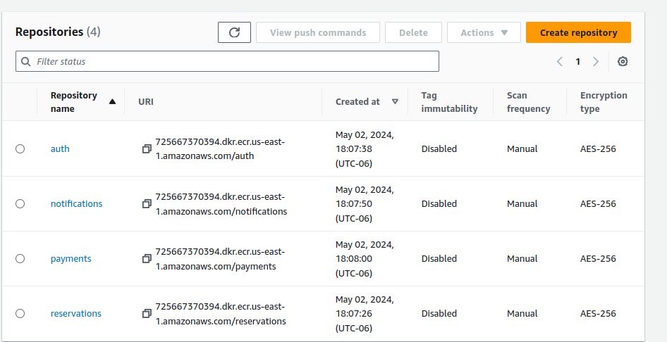

# Airbnb with nest

Reservation REST API using Nest.js


## Environment Variables

To run this project, you will need to add the following environment variables to your .env file for each app

### Auth
- MONGODB_URI=mongodb+srv://wewewew:ww@cluster0.wewwew.mongodb.net #this is the Mongo URI to connect to the database
- JWT_SECRET=mysecret12345
- JWT_EXPIRATION=3600
- HTTP_PORT=3001
- TCP_PORT=3002
### Reservation
- MONGODB_URI=mongodb+srv://wewewew:ww@cluster0.wewwew.mongodb.net #this is the Mongo URI to connect to the database
- PORT=3000
- AUTH_PORT=3002
- AUTH_HOST=auth
- PAYMENTS_SERVICE_PORT=3003
- PAYMENTS_SERVICE_HOST=payments
### Payments
- PORT=3003
- STRIPE_SECRET_KEY=sdasdasdasdas
### NOTIFICATION
- PORT=3004
- SMTP_USER
- GOOGLE_OAUTH_CLIENT_ID
- GOOGLE_OAUTH_CLIENT_SECRET
- GOOGLE_OAUTH_REFRESH_TOKEN

Note generate `STRIPE_SECRET_KEY` with [Stripe](https://dashboard.stripe.com/test/dashboard)
## Instalation
```bash
# it will recursive install depencies
npm install -g pnpm
npm install -r
```

## Running the app
To run the app, run the following command
```bash
# development
npm run start

# watch mode
$ npm run start:dev

# production mode
$ npm run start:prod
```

## Test
To run tests, run the following command
```
# unit tests
$ npm run test

# e2e tests
$ npm run test:e2e

# test coverage
$ npm run test:cov
```

## Docker
To run build, run the following command
```
# build
$ cd apps/reservations
# do same for each micro-service
$docker build -t reservations -f ./Dockerfile ../../ 

# do same for each micro-service
$ docker run reservations

# run services
$ docker-compose up
```
### Docker run services
```$ docker-compose up```

### Tag image before upload to GCloud
```
❯ docker tag reservations us-east4-docker.pkg.dev/innate-temple-417000/reservations/production


❯ docker image push us-east4-docker.pkg.dev/innate-temple-417000/reservations/production

# Just in case the previus command doesn't work use

❯ docker push us-east4-docker.pkg.dev/innate-temple-417000/auth/production
```
## Authors

- [@FelipeRamirez](https://www.github.com/mrinternauta)


## License

[MIT](https://choosealicense.com/licenses/mit/)


## Developer Notes

### Nest CLI instalation

to install nest globally, run the following command
``` bash
npm i -g @nestjs/cli 
```

### Generate new project

to create a new project with nest, run the following command
```bash
nest new <project_name>
```

### Generate new library

to create a new library with nest, run the following command
```bash
nest generate library <library_name>
```


### Generate new module for an specific project

run the following command
```bash
nest generate module <module_name> -p <library_name>
```

### Generate new micro-service 

run the following command
this will generate `apps` folder
```bash
nest generate app <project_name>
```


## Helm
- Activate Kubernetes
- Check kubernetes `kubectl version --client`
- Get name spaces `kubectl get namespaces`


### Install helm
> https://helm.sh/docs/intro/install/

```bash
❯ kubectl create deployment reservations --image=us-east4-docker.pkg.dev/innate-temple-417000/reservations/production --dry-run=client -o yaml > deployment.yaml
```
### Create helm project
- Create and navigate to `/k8s`
- Create project `helm create sleepr`
- Remove `templates` folder
- Create deployment for reservations `kubectl create deployment reservations --image=us-east4-docker.pkg.dev/innate-temple-417000/reservations/production --dry-run=client -o yaml > deployment.yaml`
- Move folder to `templates/reservations/deployment.yaml`
- Navigate to `k8s/sleepr` and install `❯ helm install sleepr .`
- Create secret to host the key to pull images from kubernetes
- before this, create API & service permission (service to allow read regsitry)   ```
❯ kubectl create secret docker-registry gcr-json-key --docker-server=us-east4-docker.pkg.dev --docker-username=_json_key --docker-password="$(cat ./sleeper-416802-ce720ed851ea.json)" --docker-email=sleeprclone.01@gmail.com
``` 
❯ kubectl patch serviceaccount default -p '{"imagePullSecrets": [{"name": "gcr-json-key"}]}'
```
-  Restart deployment to see if the pull error is resolved`❯ kubectl rollout restart deployment reservations`

- check kubernetes logs `kubectl logs reservations-76f7bc44c6-rlmbl`

- Just in case no need delete something

`kubectl get po`, and then  `kubectl delete pod reservations-b6b89c7dc-q6sdx`

- Update k8s/sleepr project (in case you changed something) `helm upgrade  sleepr  .`

### Create KubeSecrets
#### create Secret for each service (database)
```bash
╰─ kubectl create secret generic mongodb --from-literal=connectionString=mongodb+srv://user:ss@cluster0.sssxxx.mongodb.net
```
#### notification
```bash

╰─ kubectl create secret generic google --from-literal=clientSecret=xxxxx-7o-xxx --from-literal=refreshTokenKey=1//xxxx-xxx-xx
```
### Generate services
go to `/k8s/sleepr/templates/payments` or for each service
- payments `❯ kubectl create service clusterip payments --tcp=3001 --dry-run=client -o yaml > service.yaml`
- notifications `kubectl create service clusterip notifications --tcp=3000 --dry-run=client -o yaml > service.yaml`
- auth `kubectl create service clusterip auth --tcp=3002,3003 --dry-run=client -o yaml > service.yaml`
- reservations `❯ kubectl create service nodeport reservations --tcp=3004 --dry-run=client -o yaml > service.yaml`
##### update project
```
$ cd k8s/sleepr
╰─ helm upgrade  sleepr  .                                                                                                       ─╯
```
##### How to see services
`kubectl get svc`


#### payments
```bash
╰─ kubectl create secret generic stripe --from-literal=apiKey=xxxxxxxxxxxxxxxxxxxxx
```

#### auth
```bash
╰─ kubectl create secret generic jwt --from-literal=jwtSecret=mysecret12345                                                     ─╯
```


### How to fix "Error: Cannot find module 'semver'" for auth service?

I resolved that issue, switching to pnpm and pushing the images again

- Add before the first npm install for each docker image, example, 

- Second, replace all the coincidences of  npm to pnpm (including docker-compose)

- Following Remove all node_modules/ folders

- Then rebuild each image and tag it

$ docker build -t auth -f ./Dockerfile ../../ 
$ docker tag reservations us-xxx-docker.pkg.dev/innate-temple-xxx/auth/production

- Finally push it
```
❯ docker image push us-xxx-docker.pkg.dev/innate-temple-xxx/auth/production

# Just in case the previus command doesn't work use

❯ docker push us-xxx-docker.pkg.dev/innate-temple-xxx/auth/production
```

My Auth's docker file looks like this

FROM node:alpine as development

WORKDIR /usr/src/app

COPY package.json ./
COPY package-lock.json ./
COPY tsconfig.json tsconfig.json
COPY nest-cli.json nest-cli.json


COPY apps/auth apps/auth
COPY libs libs

RUN npm install -g pnpm
RUN pnpm install
RUN cd apps/auth && pnpm install

RUN pnpm run build auth

EXPOSE 3000


#prod
FROM node:alpine as production
ARG NODE_ENV=production
ENV NODE_ENV=${NODE_ENV}

WORKDIR /usr/src/app

COPY package.json ./
COPY package-lock.json ./
RUN npm install -g pnpm

RUN pnpm install --prod

COPY --from=development /usr/src/app/dist ./dist

CMD ["node", "dist/apps/auth/main"]

### Notifications error (Edit secret): oken has been expired or revoked. {"context":"RpcExceptionsHandler"}
- https://developers.google.com/oauthplayground/
- write your own keys from .env notifications
- Gmail API v1
- replace with new keys
- echo "new_refleshtoken" | base64
- export EDITOR='code --wait'
- mysecret
- kubectl edit secret google
MS8vMDR3THRESXdXdTlHcUNnWUlBUkFBR0FRU053Ri1MOUlyLS1XR0lVa2RtUmdMSlJZTFE2N1Rk
a0JNYkV4d1ZjVFhLWEJrUFNBTzhmZklsUjRNSmlSc1NiTXJpaTlRSzVHbnh1Zw==

## Deploy to AWS
- We will  use ES
- CI/CD pipelines
### Create repositories for each microservice
using Amazon Elastic Container Registry


### Installl AWS Command line
- Install <https://docs.aws.amazon.com/es_es/cli/latest/userguide/getting-started-install.html>
- Type `aws configure`
- Create crentials

